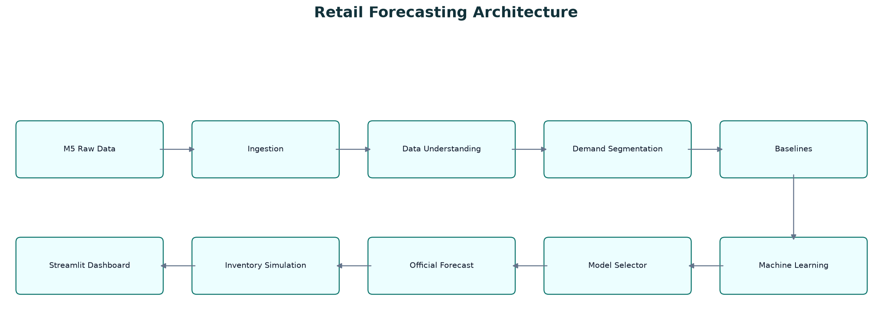
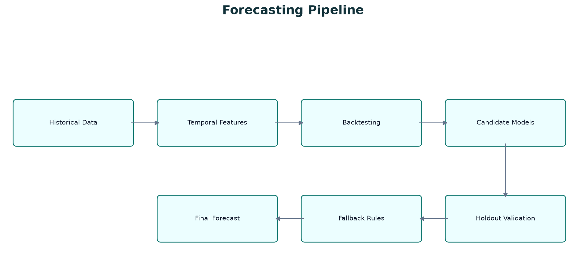
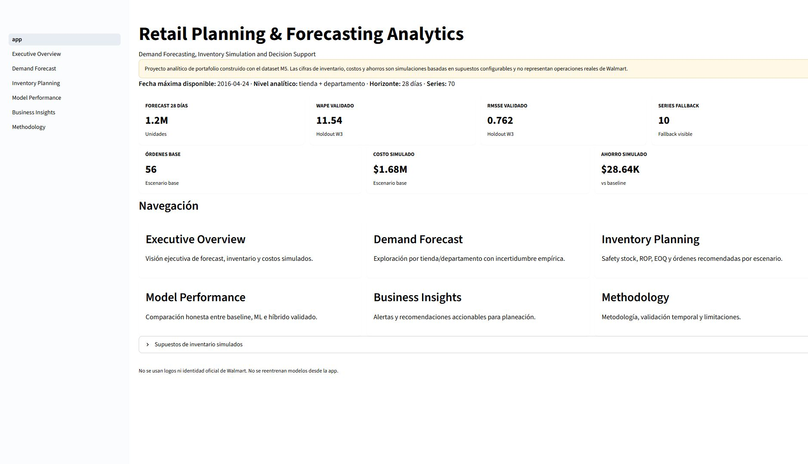
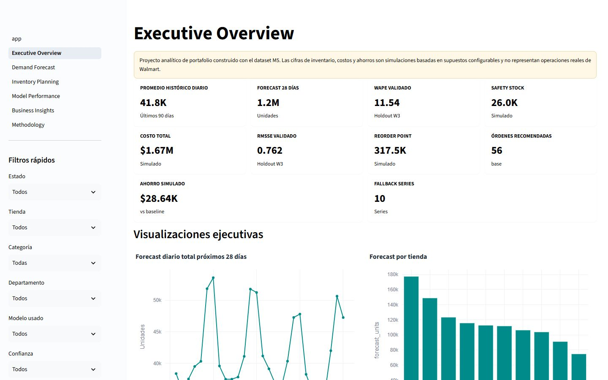
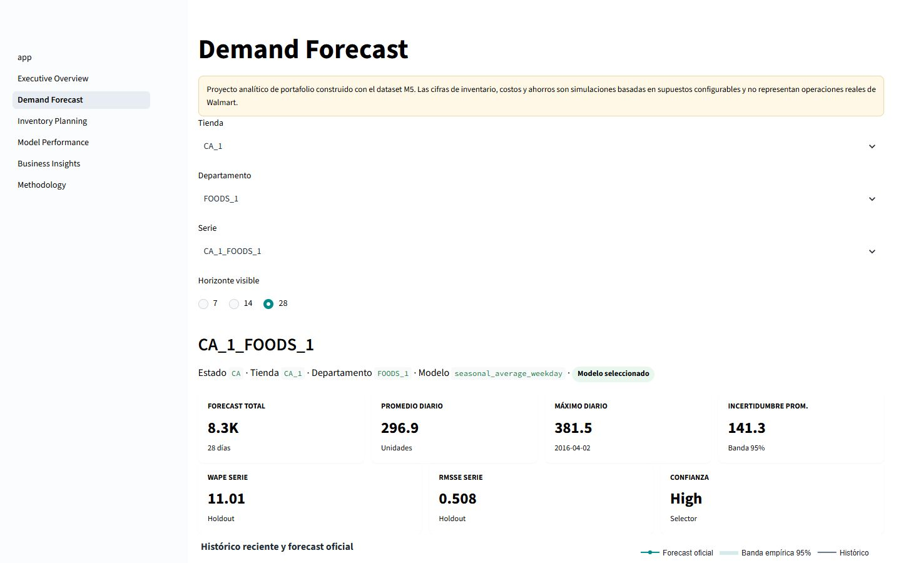
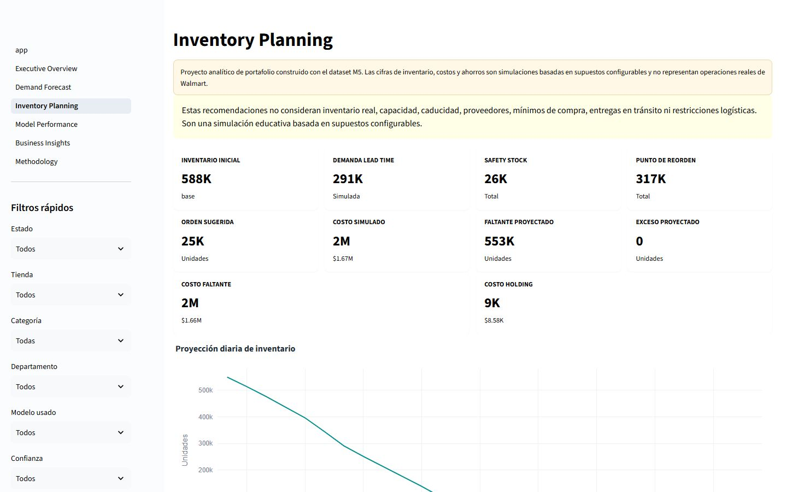
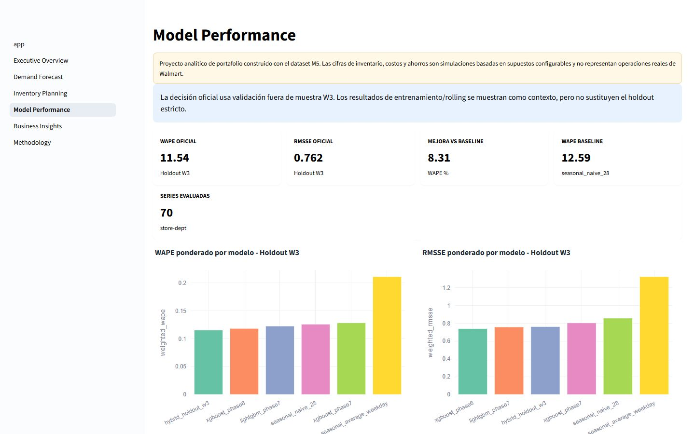
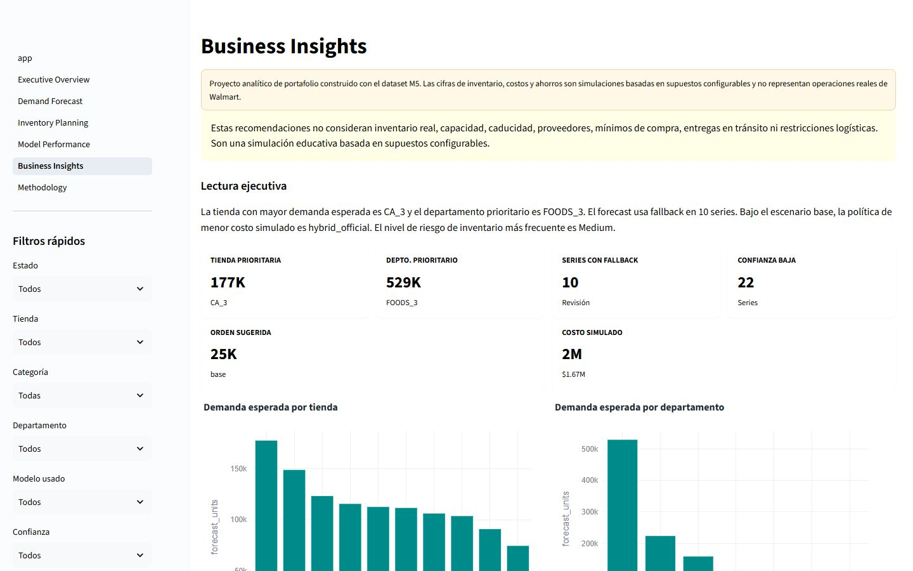

# Retail Planning & Forecasting Analytics

**Demand Forecasting, Inventory Simulation and Decision Support**


## Overview

This project is a professional retail analytics case study built with the public M5 Forecasting Accuracy dataset. It forecasts 28 days of demand for 70 store-department series, compares baseline and machine learning approaches, validates a hybrid model selector out of sample, and translates forecast outputs into a simulated inventory planning layer. The final deliverable includes a Streamlit executive dashboard for demand planning, model performance, inventory simulation, and business recommendations.

> This portfolio project uses the public M5 dataset. Inventory quantities, costs, reorder points, stockout estimates, and savings are simulated with configurable assumptions and do not represent real Walmart operations.

## Business Problem

Retail demand planning must balance service level and working capital. Poor forecasts can create stockouts, excess inventory, urgent replenishment, missed sales, and unreliable commercial planning. This project addresses that business problem by comparing forecasting methods honestly, keeping a simple seasonal benchmark visible, quantifying forecast uncertainty, and simulating how forecasts could support replenishment decisions.

## Key Results

| Metric | Result | Notes |
|---|---:|---|
| Forecasting grain | 70 series | `store_id + dept_id` |
| Forecast horizon | 28 days | Official planning horizon |
| Total official forecast | 1,165,892.25 units | Across 70 series |
| Holdout WAPE | 11.54% | Out-of-sample W3 validation |
| Holdout RMSSE | 0.762 | Out-of-sample W3 validation |
| Fallback series | 10 | Visible fallback rules applied |
| Simulated base orders | 56 | Inventory simulation output |
| Simulated base cost | 1,680,537.514 | Assumption-based estimate |
| Simulated savings vs baseline | 28,643.443 | Assumption-based estimate |
| Automated tests | 72 passed | Current validation suite |

## Methodology

1. Data ingestion and validation from the public M5 dataset.
2. Data understanding without melting the full item-store matrix unnecessarily.
3. Demand segmentation using ADI/CV2, ABC volume classes, and XYZ variability classes.
4. Baseline forecasting with temporal backtesting.
5. Machine learning forecasting with scikit-learn, XGBoost, and LightGBM.
6. Hybrid model selection with out-of-sample validation.
7. Empirical uncertainty estimation from backtesting errors.
8. Simulated inventory planning using configurable assumptions.
9. Streamlit dashboard for executive exploration and decision support.

## Model Results

The project does not force machine learning to win. `seasonal_naive_28` remained a strong individual benchmark by WAPE, while XGBoost improved RMSSE in one modeling phase. The final official forecast uses a validated hybrid selector because it performed best in the strict out-of-sample holdout evaluation. Fallback logic remains visible for low-confidence or unavailable model outputs.

## Architecture



Editable source: [`docs/architecture_diagram.mmd`](docs/architecture_diagram.mmd)

## Forecasting Pipeline



## Dashboard

Final public portfolio audit: [docs/FINAL_PORTFOLIO_AUDIT.md](docs/FINAL_PORTFOLIO_AUDIT.md).


Run locally with Streamlit to explore forecasts, uncertainty, model performance, inventory scenarios, and business recommendations.













## Tech Stack

- Python
- Pandas
- NumPy
- scikit-learn
- XGBoost
- LightGBM
- Streamlit
- Plotly
- PyArrow
- Pytest
- Parquet
- Kaggle API

## Repository Structure

```text
retail-demand-forecasting/
|-- config/                  # Configurable inventory assumptions
|-- dashboard/               # Streamlit dashboard, components, and services
|-- data/                    # Local data folders, ignored except placeholders
|   |-- raw/
|   |-- interim/
|   `-- processed/
|-- docs/                    # Portfolio documentation, diagrams, images, guides
|-- models/                  # Local model artifacts, ignored except placeholders
|-- notebooks/               # Phase notebooks for analysis and communication
|-- reports/                 # Markdown reports and generated summaries
|-- src/                     # Reusable project scripts and analytical pipeline
|-- tests/                   # Automated validation tests
|-- CASE_STUDY.md            # Portfolio case study
|-- README.md
|-- requirements.txt
`-- pyproject.toml
```

## How to Run

Clone the repository and create a virtual environment:

```powershell
git clone https://github.com/Mooy10/retail-demand-forecasting.git
cd retail-demand-forecasting
python -m venv .venv
.\.venv\Scripts\Activate.ps1
python -m pip install --upgrade pip
pip install -r requirements.txt
```

Configure Kaggle credentials and accept the M5 competition rules on Kaggle. Then download and validate raw data:

```powershell
python src\download_data.py
python src\data_ingestion.py
```

Run the dashboard:

```powershell
streamlit run dashboard\app.py
```

If you do not want to run the full pipeline, the dashboard requires the processed forecast, uncertainty, model validation, and inventory simulation artifacts under `data/processed/`, `reports/`, and `config/`. These generated data files are intentionally excluded from GitHub because of size and reproducibility concerns.

## Testing

```powershell
python -m pytest tests -p no:cacheprovider -q
```

Current validated result:

```text
72 passed
```

## Limitations

- The dataset is historical and public, not live operational data.
- The official forecast is at store-department level, not every item-store pair.
- Inventory quantities, costs, stockouts, reorder points, and savings are simulated.
- The project does not use real inventory, supplier constraints, capacity, lead times, or ERP data.
- The dashboard does not retrain models from the UI.
- This is not an official Walmart solution and does not represent Walmart operational results.

## Future Work

- Extend forecasting to prioritized item-store series.
- Incorporate real inventory, orders, supplier lead times, and service constraints.
- Add Power BI or executive PDF reporting.
- Deploy the dashboard in a controlled cloud environment.
- Integrate ERP or replenishment system inputs.
- Add automated data quality and model monitoring.

## Disclaimer

This project uses the public M5 dataset for educational and portfolio purposes. It does not represent a solution developed for Walmart, and the simulated business results should not be interpreted as real operational outcomes.

## License

MIT License. See [`LICENSE`](LICENSE).
